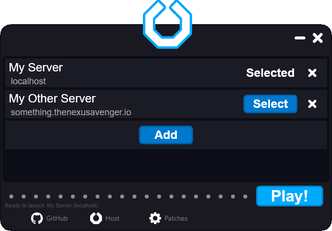

# Client Setup
This document covers setting up the client for playing
LEGO Universe.

# TL;DR
* Download and run the GUI client for your platform.
* Press "Play!" to start the download.
* Press "Add" to add servers, then "Select" a server.
* Modify the patches if needed.
* Press "Play!" to launch.

# Download
Before running the client, the launcher needs
to be downloaded. All of the downloads can
be found from the latest
[release of Nexus LU Launcher](https://github.com/TheNexusAvenger/Nexus-LU-Launcher/releases/tag/V.0.2.1).
After downloading and opening, you will see the
following:

## Windows
From the releases, download `Nexus-LU-Launcher-Windows-x64.zip`
and unzip. Optionally, move it somewhere that is not
your downloads folder. Open `Nexus-LU-Launcher.exe` (Nexus LU
Launcher Graphical User Interface) to open the launcher.
On the first launch, you will get a message from
Microsoft Defender SmartScreen saying the program can't
be verified. Click "More Info" and then "Run Anyway".

## macOS
As of version 0.2.0, the macOS release is published
as a macOS application. From the releases, download
`Nexus-LU-Launcher-macOS-x64.zip`. macOS will automatically
unzip it, so you will the application in your downloads.
Optionally, move it to your Applications folder.
On the first launch, you will get a message from macOS
Gatekeeper saying the application is from an unidentified
developer. Unlike Windows, this requires a few steps
to get around.

From System Preferences, go to "Security & Privacy"
and go to the "General" tab (first tab) if you aren't
there already. Click "Open Anyway" next to the warning
about Nexus LU Launcher being blocked.

Once pressed, you will get another warning from macOS
Gatekeeper about the application. Click "Open" to continue.

## Linux
The Linux builds require an extra step to setup.
LEGO Universe is shipped as a Windows application
and requires WINE ("**W**INE **I**s **N**ot an
**E**mulator") to be installed. The macOS version
is handled internally, but the Linux setup requires
manual setup. Consult guides online on how to do this
if you haven't set up WINE before. Make sure to search
your distribution and version, like Ubuntu 20.04 or
CentOS 8, instead of just "Linux".

Once WINE is set up, download `Nexus-LU-Launcher-Linux-x64.zip`
and unzip it. Optionally, move it somewhere that is not
where you downloaded it. From the command line,
open the `Nexus-LU-Launcher` (Nexus LU Launcher Graphical User
Interface) file. For creating a shortcut, consult a
guide online since it varies for each desktop interface.

If you open the application and it says that WINE is not
installed instead of "Pending client download", WINE is
not set up correctly. From a command line, `wine --version`
should return a valid result.

# Client Download
In order to play the game, the LEGO Universe client
must be downloaded. The patcher handles this with
the following steps:
* Install WINE Crossover. *(macOS Only)*
* Download the client.
  * The client is "unpacked", meaning it has the resource
    files requires for developing hosting servers.
* Extract the client.
* Apply the default patches for use with servers like Uchu.

All of this is done automatically by pressing "Play!",
although only the download stage will give an actual progress
bar. The setup will take some time.

One the download is complete, assuming the next step of
adding servers wasn't done, the "Play!" button will be grey
and say no server is selected.

# Adding Servers
By default, no servers are listed. To add a server,
click "Add", then enter a unique name (can be anything)
and the address of the server. If you are playing single
player on your system, use `localhost` or `127.0.0.1`.
If you are using a server hosted by someone else, they
will give you an address to use, either as a host name or
set of 4 numbers. Once you are done, press "Add".

Once you add your server(s), press "Select" next to the
server you want to play, then press main the "Play!" button
after it turns blue. The client will open and you log in
and start playing!

# Patches
After downloading the client, "Patches" becomes visible
on the bottom of the window. If you need to modify, update
or delete patches for LEGO Universe, you will do it here.

# Remarks
### What happens if the download is interrupted?
The launcher should be able to recognize when the download
is corrupted and know to restrart it. It is in't, delete
the `Client` directory in `%USERPROFILE%/.nlul` on Windows
or `~/.nlul` on macOS and Linux.

### Can I create servers using the launcher?
It is planned but is currently not implemented. Going
to "Hosts" on the bottom will show "Not implemented in
this release."

### What is TCP/UDP?
TCP/UDP (or TcpUdp) is a client mod used by some servers
projects, like Uchu, for client to server communication.

### What Auto is TCP/UDP?
Auto TCP/UDP is a patch introduced in V.0.2.1 that automatically
enables or disables TCP/UDP depending on the server. Previously,
the patch would need to be manually installed or removed depending
on the target server.

### When logging in, it says it "Could not sign you in to LEGO Universe" then showed the characters after a few seconds. Is this normal?
This is normal. A side effect of using TCP/UDP is that
this message is displayed between connecting to the
authorization server and loading the character list. 
If it persists more than several seconds, the server
may actually be unreachable. You will recieve a different
message if the username or password is bad.

### Why is there a "Missing NIF" sign above the Assembly Vendor in Nimbus Station?
For some reason, the reference to the Assembly hologram
in Nimbus Station is incorrect with the client used.
A patch may be able to fix this in the future, but
this needs to be investigated.

### Uchu supports Guilds. Is there a patch?
Guilds currently does not have a patch. This may be
added in a later release.

### I downloaded a client before. Can I use that?
To ensure the integrity of the client and patches,
the other client can't be used.