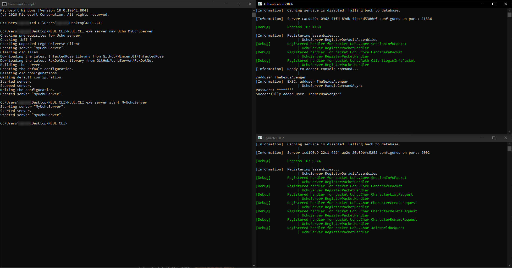

# Server Setup (Uchu)
This document covers setting up
[Uchu](https://github.com/uchuserver/uchu)
for LEGO Universe as single player. Setting
up for hosting is not covered in this
document and is not supported by the
tool at this point. See the remarks for more.

# Disclaimer: Command Line
This document includes using the command line,
which is either Command Prompt on Windows or Terminal
on macOS and Linux. If you don't know how to use
it, as in running commands in specific directories,
you will have trouble with this document. You will
also have trouble with a manual setup since it
requires the command line for building and setting
up the configuration.

# TL;DR
* Download the CLI (**C**ommand-**L**ine **I**nterface) tool for your platform.
* Run `./NLUL.CLI server new Uchu MyServer`
* Run `./NLUL.CLI server start MyServer`
* Run `/adduser <put_some_username_here>` in the new window titled `Authentication:21836` and follow the prompts.
* Connect to `localhost` or `127.0.0.1`.

## Windows Commands
For Windows, open a command prompt, and enter
the following to download, create, and run the
server. You will need to complete the last 2
steps manually.
```cmd
:: Download the CLI tool.
curl -L https://github.com/TheNexusAvenger/Nexus-LU-Launcher/releases/download/V.0.2.0/NLUL-CLI-Windows-x64.zip --output nlul.cli.zip
mkdir %USERPROFILE%\nlul.cli
tar -zxf nlul.cli.zip -C %USERPROFILE%\nlul.cli
del nlul.cli.zip

:: Change to the directory of the tool.
cd %USERPROFILE%\nlul.cli

:: Create the server.
NLUL.CLI.exe server new Uchu MyServer

:: Start the server.
NLUL.CLI.exe server start MyServer
```

To stop the server:
```cmd
:: Move to the directory of the tool.
cd %USERPROFILE%\nlul.cli

:: Stop the server.
NLUL.CLI.exe server stop MyServer
```

To start the server after stopping:
```cmd
:: Move to the directory of the tool.
cd %USERPROFILE%\nlul.cli

:: Start the server.
NLUL.CLI.exe server start MyServer
```

## macOS Commands
For Windows, open a command prompt, and enter
the following to download, create, and run the
server. You will need to complete the last 2
steps manually.
```bash
# Download the CLI tool.
curl -L https://github.com/TheNexusAvenger/Nexus-LU-Launcher/releases/download/V.0.2.0/NLUL-CLI-macOS-x64.zip --output nlul.cli.zip
mkdir ~/nlul.cli
unzip ./nlul.cli.zip -d ~/nlul.cli
rm ./nlul.cli.zip

# Change to the directory of the tool.
cd ~/nlul.cli

# Create the server.
./NLUL.CLI server new Uchu MyServer

# Start the server.
./NLUL.CLI server start MyServer
```

To stop the server:
```bash
# Move to the directory of the tool.
cd ~/nlul.cli

# Stop the server.
./NLUL.CLI server stop MyServer
```

To start the server after stopping:
```bash
# Change to the directory of the tool.
cd ~/nlul.cli

# Start the server.
./NLUL.CLI server start MyServer
```

## Linux Commands
For Windows, open a command prompt, and enter
the following to download, create, and run the
server. You will need to complete the last 2
steps manually.
```bash
# Download the CLI tool.
curl -L https://github.com/TheNexusAvenger/Nexus-LU-Launcher/releases/download/V.0.2.0/NLUL-CLI-linux-x64.zip --output nlul.cli.zip
mkdir ~/nlul.cli
unzip ./nlul.cli.zip -d ~/nlul.cli
rm ./nlul.cli.zip

# Move to the directory of the tool.
cd ~/nlul.cli

# Create the server.
./NLUL.CLI server new Uchu MyServer

# Start the server.
./NLUL.CLI server start MyServer
```

To stop the server:
```bash
# Move to the directory of the tool.
cd ~/nlul.cli

# Stop the server.
./NLUL.CLI server stop MyServer
```

To start the server after stopping:
```bash
# Move to the directory of the tool.
cd ~/nlul.cli

# Start the server.
./NLUL.CLI server start MyServer
```

# Download
For all platforms (Windows, macOS, and Linux),
Download the command line tool and extract it.
* Windows: `NLUL-CLI-Windows-x64.zip`
* macOS: `NLUL-CLI-macOS-x64.zip`
* Linux: `NLUL-CLI-Linux-x64.zip`

# Creating Servers
## Windows
Open a command prompt window and go to the directory
where you extracted the files to and have `NLUL.CLI.exe`.
For example, if it is on your Desktop, use:
```cmd
cd C:\Users\<YOUR NAME>\Desktop\<EXTRACTED DIRECTORY NAME>
```

Using `NLUL.CLI.exe`, call `server new Uchu <name>` where
`name` is a unique name for you to reference later.
```bash
NLUL.CLI.exe server new Uchu MyUchuServer
```

## macOS and Linux
Open a command prompt window and go to the directory
where you extracted the files to and have `NLUL.CLI`.
For example, if it is on your Desktop, use:
```cmd
cd ~/Desktop/<EXTRACTED DIRECTORY NAME>
```

Using `NLUL.CLI`, call `server new Uchu <name>` where
`name` is a unique name for you to reference later.
```bash
./NLUL.CLI server new Uchu MyUchuServer
```

# Starting Servers
## Windows
Open a command prompt window and go to the directory
where you extracted the files to and have `NLUL.CLI.exe`.
For example, if it is on your Desktop, use:
```cmd
cd C:\Users\<YOUR NAME>\Desktop\<EXTRACTED DIRECTORY NAME>
```

Using `NLUL.CLI.exe`, call `server start <name>` where
`name` is the name you used in the create step.
```cmd
NLUL.CLI.exe server start MyUchuServer
```

## macOS and Linux
Open a command prompt window and go to the directory
where you extracted the files to and have `NLUL.CLI`.
For example, if it is on your Desktop, use:
```bash
cd ~/Desktop/<EXTRACTED DIRECTORY NAME>
```

Using `NLUL.CLI`, call `server start <name>` where
`name` is the name you used in the create step.
```bash
./NLUL.CLI server start MyUchuServer
```

# Stopping Servers
## Windows
Open a command prompt window and go to the directory
where you extracted the files to and have `NLUL.CLI.exe`.
For example, if it is on your Desktop, use:
```cmd
cd C:\Users\<YOUR NAME>\Desktop\<EXTRACTED DIRECTORY NAME>
```

Using `NLUL.CLI.exe`, call `server stop <name>` where
`name` is the name you used in the create step.
```cmd
NLUL.CLI.exe server stop MyUchuServer
```

## macOS and Linux
Open a command prompt window and go to the directory
where you extracted the files to and have `NLUL.CLI`.
For example, if it is on your Desktop, use:
```bash
cd ~/Desktop/<EXTRACTED DIRECTORY NAME>
```

Using `NLUL.CLI`, call `server stop <name>` where
`name` is the name you used in the create step.
```bash
./NLUL.CLI server stop MyUchuServer
```

# Adding Users
After starting, type and enter the `/adduser <username>`
with the username you want in the window named
`Authentication:21836`. You will be prompted with a
password to use.



# Remarks
### Does this work for other projects like OpCrux?
No. NLUL.CLI currently does not support projects other
than Uchu. This functionality will be added later.

### Where is my data stored?
In your user/home directory, it will be under
`.nlul/Server/<ServerName>/Server/Uchu.Master/Debug/net5.0/Uchu.sqlite`.
If you have an existing setup with Uchu using
SQLite (you will have this file in your setup),
then you can copy it over.

### How do I modify the configuration? (How do I add certificates for remote hosting?)
Since the configuration is deleted when updated,
overrides to the configuration are used. These overrides
are stored in `.nlul/Server/<ServerName>/state.json`.

### Uchu updated. How do I update?
With your server stopped, run `server update <name>` to
update. If there are no updates, nothing will happen.